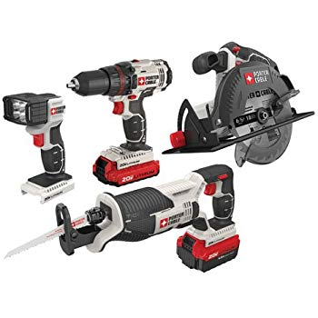

# Requirements

* Prinesi presentation
* Instalacija Atom editorja

# Predstavitev

* Predstavitev ljudi
    * Predstavi samega sebe + tecaj
    * Predstavi asistenta

* Predstavi kako bo predavanje potekalo
    * Teorija
    * Moja demonstracija
    * Pisanje programov (atom)
    * V primeru vprasanj

* Predstavi dneve tecaja
    * HTML (1.dan)
    * CSS stiliranje HTML-ja (2.dan)
    * Bootstrap framework + vasa lastna spletna stran (3.dan)

* Kaj ne bodo tecajniki znali ob koncu tega tecaja
    * Ustvariti dinamicno spletno stran ki se spreminja z interakcijo
        * Spletne trgovine
        * Forum
        * Programiranja
    
* Kaj bodo tecajniki znali ob koncu tega tecaja
    * Postaviti staticno spletno stran (stran ki se z interakcijo ne spreminja)
    * Spoznali osnovne gradnike spletnih strani
    * Spoznali orodja za hitrejse pisanje spletnih strani
    * Spoznali razne trike kako spletno stran narediti "lepo"
    * Imeli zacetno teoreticno znanje za nadaljne ucenje spletnih tehnologij
    * Da se ne boste bali pisanja spletnih strani

* Zakaj vas ne ucimo cms-a(content managment sistems) wordpressa/google sites/squarespace?
    * Ker se v ozadju skriva HTML tehnologije in so temelj spletnih tehnologij.
    * Ker boste bolje razumeli tehnologije ki so bile zgrajene na HTML-ju.
    * Razumeli boste kako deluje splet.
    * Znal boste kaj pohekat.
    





    
# Predstavitev editorja

* [Atom IDE](https://atom.io)
    * Instalacija programa
    * Zastonj, enostaven
* (demo) Zakaj ravno ta editor in zakaj ne TextEditor
    * Code completion
    * Code folding
    * LivePreview (browser-plus)
    * Code formating
    * Error/Warning verbosity (w3c validation)
    * (demo) Shranjuj dokument cim veckrat (za vsako spremembo)
* Installacija pluginov
    * browser-plus
    * w3c-validation
    * atom-beautify
* Demonstracija
    * Ustvarjanje zacetne index.html strani
    * Kako ustvarim zacetno spletno stran in jo prikazem v browserju
    * Kako shranim in odprem datoteko html v browserju (na roko)

# Razlaga osnovnega templejta za index.html

* Zakaj index.html
    * Glavna zacetna tocka (industrijski standard)
    * html => Hyper Text Markup Language
* Izogibanje presledkov v imenih datotek
    
# Znacke osnovno

* Znacke so imena/kratice elementov spletne strani obkrozeni z `<` in `>` znakom
* Za imena znack ni pomembno ali jih pisemo z velikimi crkami ali z majhnimi (ponavadi pisemo z majhnimi crkami)
* Osnovni elementi (tags-znacke) opisejo kako naj se vsebina znack prikaze v browserju
* (demo) Prikaze se samo vsebina znack (ne pa tudi same tacke)

# Atributi znack

* Vse znacke imajo lahko atribute
* Kaj je atribut?
* Atribut nosi dodatne informacije o elementu (primer atribut predmetov)
* Atribut je zmeraj definiran v zacetni znacki nikoli v koncni!
* Atribut mora imeti zmeraj definirano ime in vrednost v dvojnih narekovajih!
* Ime atributa ne sme imeti v sebi presledka (lahko pa minus)!
* Demonstracija

# Polne znacke (z vsebino)

```html
<ime-znacke>Vsebina</ime-znacke>
<ime-znacke atribut="vrednost">Vsebina</ime-znacke>
<ime-znacke atribut="vrednost atributa" atribut2="vrednost atributa2" ... > Vsebina </ime-znacke>

<a target="_blank" width=300 href="https://www.google.com">Link do googla</a>
```

* Znacke normalno nastopajo v parih kot recimo `<p> ... </p>` takim elementom recemo polni elementi
    * Prva tacka `<p>` je zacetna tacka elementa in tacka `</p>` predstavlja zakljucno znacko elementa.
    * Koncna tacka je napisana enako kot zacetna tacka ampak samo z znakom za deljeno `/` kateri simbol predstavlja besedo zakljuci.
    * **Zacni p(paragraph) ... /=Koncaj paragraph**

# Prazne znacke (brez vsebine)

```html
<ime-znacke>
<ime-znacke atribut="vrednost">

<br>

```

* Obstajajo tudi prazni elementi ki imajo samo zacetno tacko `<br>`

# Obvezne tacke v vsakem html dokumentu in njihova struktora

```html
<!DOCTYPE html>
<html> ... </html>
<head> ... meta podatki ... </head>
<title> ... naslov ... </title>
<body> ... vidna vsebina ... </body>
```

* Vizualizacija html strukture
* Teorija gnezdenja znack in primerjava z mizo in papirji.


    
  
# Najpogostejse napake zacetnikov

* Zacetna tacka ni zakljucena z koncno tacko (demo error msg)
* Napacno gnezdenje znack (zacetna znacka lezi v starsu, a koncna znacka pa ne) (demo error msg)
* presledki v imenih znack (demo error msg)
* Resitve za probleme:
    * (demo) Validacija html dokumenta (branje error sporocil)
    * (demo) formatiranje kode
     
# Slogovni elementi

* funkcijonalnost worda vs html
* Znacke
    * h1 header
    * p paragraph 
    * b bold 
    * br break
    * hr horizontal-rule
    * u underline 
    * i italic 
    * q quotation 
    * small
    * ul,ol (un)ordered-list
    * li listitem
    * img image
* Attributi
    * align
    * width (%, px)
    * height

* Posebne znacke
    * a anchor
        * href (zunanja, notranji html, notranji element, notranji html + notranji element)
        * id identifikacija
        * Izogibanje presledkov v imenih datotek
    * table
        * tr tablerow
        * td tabledata
        * th tableheader
        * nestane tabele
    
# Dokumentacija + cheetsheet
    
* [HTML cheet sheet](https://htmlcheatsheet.com/)
* [HTML reference](https://www.w3schools.com/tags/default.asp)

# Ustvarjanje portfolio strani

* Predstavitev problema
* Predstavitev strukture
* empty table generator
* navigacija
* table
    * border
    * width=100
    * vnos elementov h1, p, img, ol, hr
    * collumespan
    * rowspan
    * image
    * youtube video
    * google maps
