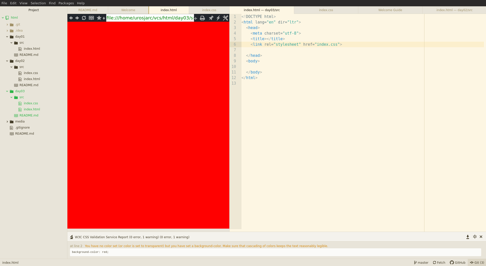
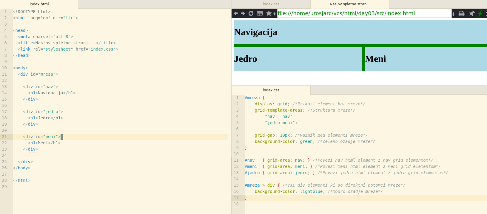
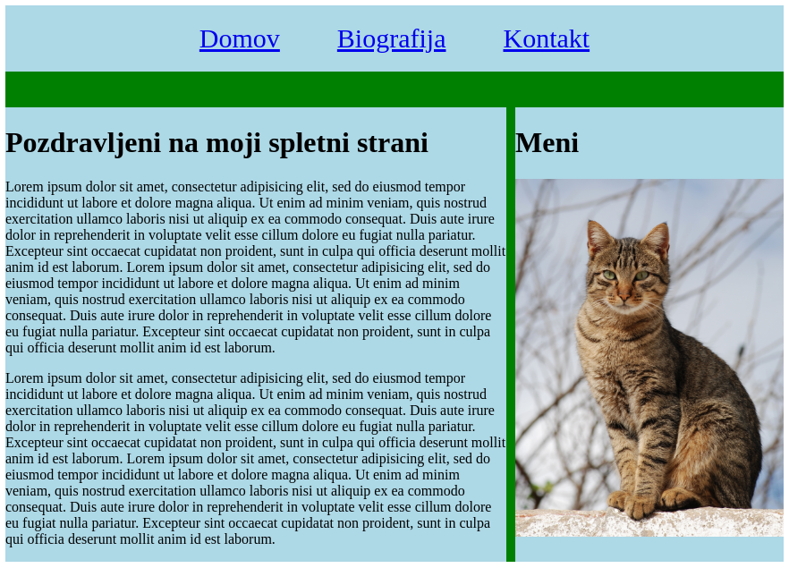
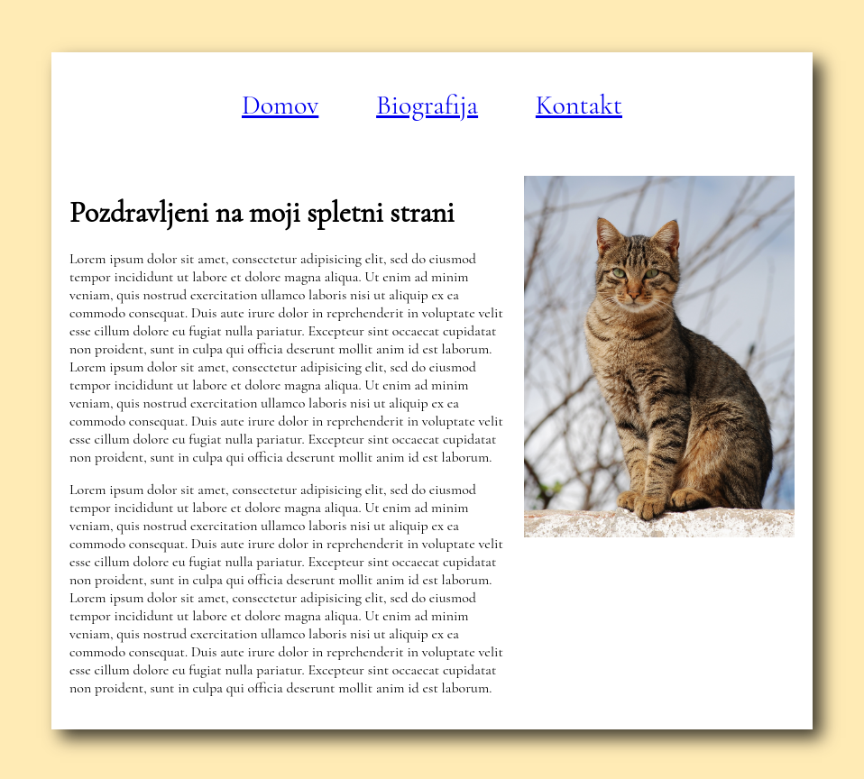

## Osebni portfolio

Se enkrat bomo ustvarili primer nase spletne strani da se se enkrat spomnimo
kako ustvarjamo spletno stran.

## Ustvarimo index.css in index.html

* Ustvarimo `index.html` datoteko.
* Napisemo v prazno `index.html` datoteko besedo **`"html"`** in pritisnemo enter da dobimo osnovni template prazne strani.
* Ustvarimo prazno `index.css` datoteko zraven `index.html`.

## Povezemo index.html in index.css

* Znotraj `<head> ... </head>` znacke v datoteki `index.html` napisemo besedo **`"link"`** ter pritisnemo enter.
* Ta akcija ustvari element ... **`<link rel="stylesheet" href="/css/master.css">`**.
* V ustvarjenemu elementu popravimo **`"href"`** atribut da kaze na `index.css` ... **`<link rel="stylesheet" href="index.css">`**
* Da potestiramo ce smo dobro povezali `index.html` in `index.css` vnesemo v `index.css` datoteko ... text **`body {background-color: red;}`**
* Odpremo `index.html` datoteko tako da odpremo `index.html` predogled ... **desni-klik/OpenBrowser-plus**



## Ustvarimo mrezo HTML-ja

* Dodamo osnovno strukturo elementov v **`index.html`**.

```html
<div id="mreza">

        <div id="nav">
              <h1>Navigacija</h1>
        </div>

        <div id="jedro">
              <h1>Jedro</h1>
        </div>

        <div id="meni">
              <h1>Meni</h1>
        </div>

</div>
```

* Aktiviramo mrezni sistem za starsa `<div id="mreza"> ... </div>` v **`index.css`** datoteki.

```css
#mreza {
    display: grid; /*Prikazi element kot mrezo*/
    grid-template-areas: /*Struktura mreze*/
        "nav   nav"
        "jedro meni";
        
    grid-gap: 10px; /*Razmik med elementi mreze*/
    background-color: green; /*Zeleno ozadje mreze*/
}
```

* V css-u povezemo **mrezne elemente** z **html elementi**.

```css
#nav   { grid-area: nav; } /*Povezi nav html element z nav grid elementom*/ 
#meni  { grid-area: meni; } /*Povezi meni html element z meni grid elementom*/ 
#jedro { grid-area: jedro; } /*Povezi jedro html element z jedro grid elementom*/ 
```

* Potem pa se pobarvamo ozadje elementov v mrezi

```css
#mreza > div { /*Vsi div elementi ki so direktni potomci mreze*/
    background-color: lightblue; /*Modro ozadje mreze*/
}
```

* Preverimo ce nasa spletna stran zgleda nekako takole...



## Ustvarimo vsebino

* Dodamo elemente v jedro (text, itd...)
* Dodamo elemente v meni (sliko, nase informacije, itd...)
* Ko dodamo sliko v meni jo je potrebno identificirati z **`id="slika"`** ter dodati responsive elemente v **css-u**.

```css
#slika {
  width: 100%; /*Slika naj zavzema 100% sirine starsa*/
  max-width: 300px; /*Maximalna sirina slike pa naj bo 300px*/
}
```


## Ustvarimo meni linke

```html
<div id="nav">
    <a href="index.html">Domov</a>
    <a href="bio.html">Biografija</a>
    <a href="kontakt.html">Kontakt</a>
</div>
```

```css
#nav {
  text-align: center; /*Text v navigaciji naj bo osredinjen na sredino*/
  padding: 20px; /*Notranji razmik naj se poveca*/
  margin-bottom: 30px; /*Zunanji odmik od spodnjih menijev naj se poveca*/
}

#nav * { /*Vsi elementi v navigaciji*/
    margin: 0 30px; /*Razmaki od linkov naj se poveca*/
    font-size: 30px; /*Povecaj text v navigaciji*/
}
```



## Uredimo body element

* Dodamo ozadje in notranji odmik od body elementa

```css
body {
    padding: 50px;
    background-color: #ffebb5;
}
```

## Uredimo mrezo in njegove elemente

```
#mreza * {
    background-color: white;
}
```

## Linkamo font v head in dodamo font ter senco na mrezo

* https://fonts.google.com
* https://www.cssmatic.com/box-shadow

```html
    <link href="https://fonts.googleapis.com/css?family=Cormorant+Garamond&display=swap" rel="stylesheet">
```

```css
#mreza {
    font-family: 'Cormorant Garamond', serif;
    -webkit-box-shadow: 10px 10px 18px 0px rgba(0,0,0,0.75);
    -moz-box-shadow: 10px 10px 18px 0px rgba(0,0,0,0.75);
    box-shadow: 10px 10px 18px 0px rgba(0,0,0,0.75);
}
```



## Dodamo podstrukture spletne strani

* Kopiramo `index.html` v `bio.html`, `kontakt.html`.
* Modificiramo vsebino.

## Publishing spletne strani (github pages)...

* https://pages.github.com/